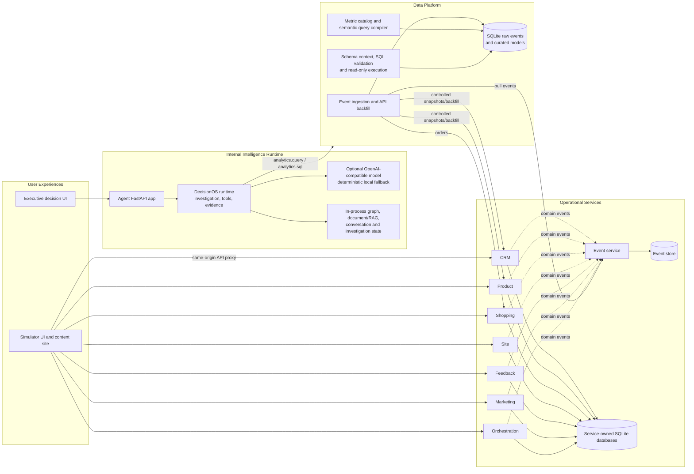

# Customer360 Architecture

Customer360 is a locally runnable synthetic enterprise intelligence system. It separates customer-facing operational workflows from internal analytics and decision support. Operational services own their records; the Data Platform derives cross-service analytical views; the Agent application reaches business data through governed tools and the Data Platform rather than querying operational databases directly.

This document distinguishes the current repository implementation from the broader target architecture. Dashed or target-state concepts in the existing architecture notes must not be read as claims that every production integration is present.

## System Context



## Components and Ownership

### Experiences and application entry points

- The Shopping Simulator is a static browser application served by `Enterprise/Simulator/server.py`. Its server also proxies API paths to the local services, allowing browser interactions to use the service APIs on a same origin. The simulator emits realistic journeys and events; it is not the source of truth for service records.
- The Agent application is a FastAPI service with an executive UI at `/` and API endpoints for executive briefs, investigations, semantic lookup, graph operations, and document/RAG retrieval. It is an internal decision experience and is not in the public transaction path.

### Operational service layer

Each service owns its API, domain invariants, and private SQLite persistence. Cross-service operational workflows use APIs and identifiers rather than shared tables.

| Service | Primary responsibility |
|---|---|
| CRM | Customer identities, profiles, and segments |
| Product | Product catalog, categories, prices, and promotions |
| Shopping | Carts, orders, order items, and payments |
| Site | Sites, visits, and session activity |
| Feedback | Customer feedback and ratings |
| Marketing | Campaigns, audiences, channels, and interactions |
| Orchestration | Cross-service operational workflow coordination |
| Events | Immutable event envelopes, filtering, and replay |

Operational service changes publish versioned event envelopes to the Event service. Envelopes carry source service, event and aggregate identity, payload, occurrence time, schema version, correlation data, and optional idempotency information. The current event service persists envelopes in a local SQLite store; it is not a distributed broker.

### Data Platform

The Data Platform pulls event batches from the Event service and derives `raw_events` and curated analytical tables in its own SQLite warehouse. Its ingestion endpoint also refreshes selected operational data through service APIs, including order, product/category, and customer-profile backfills. These are API reads, not direct access to service databases.

The Data Platform currently provides:

- Curated KPI endpoints for revenue, visits, conversion, cart abandonment, product performance, and related measures.
- Event ingestion, idempotency, data quality, coverage, and reconciliation endpoints.
- A semantic query path that accepts constrained metric/dimension/filter input, validates it against the metric catalog, compiles parameterized SQL, and returns governed results and metadata.
- A Text-to-SQL path that provides principal-scoped schema context and accepts only validated read-only queries. It uses SQLite read-only execution controls, table authorization, result limits, and execution time bounds.
- A payment-failure profile breakdown that applies commerce authorization, aggregates failures by current CRM attributes, suppresses small groups, and does not return customer names or IDs.

The warehouse and its curated tables are analytical projections. They do not replace the operational databases. See [Enterprise/DataPlatform/README.md](Enterprise/DataPlatform/README.md) for endpoint details and query rules.

### Agent and DecisionOS layer

The Agent application receives executive questions and routes analytics through registered DecisionOS tools. The current executive analytics workflow checks the principal's analytics permission, selects an allowlisted metric/query shape, dispatches a governed tool request, and returns source, query, freshness, limitations, and evidence metadata. With model configuration enabled, an OpenAI-compatible model can select a governed metric or help synthesize a response; SQL generation is bounded by pruned schema context and Data Platform validation. Without a configured model, deterministic local behavior is used for the corresponding routes.

DecisionOS supplies contracts and runtime components for investigation lifecycle, tool catalog and dispatch, permission checks, service adapters, evidence assembly, semantic definitions, graph/RAG retrieval, and evaluation. The app currently uses in-memory investigation/conversation persistence and in-process graph/document stores. These runtime stores are not durable across process restarts. The SQL-backed operational and analytical SQLite databases persist separately.

The broader DecisionOS prompt and agent specifications define bounded specialist roles and intended graph, RAG, memory, and decision workflows. Their presence as specifications or library components does not mean each workflow is automatically populated from live enterprise data or stored durably.

## Principal Data Flows

### Customer transaction and simulation path

```text
Browser simulator -> service API -> owning service SQLite database
                                  -> Event service -> event store
```

The simulator uses services for customer-facing actions such as browsing, cart operations, checkout, and feedback. Orchestration coordinates initial cross-service workflows through APIs. Services publish domain events so downstream analytics can observe changes without reading their private tables.

### Analytics ingestion path

```text
Event service -> Data Platform ingestion -> raw event and curated SQLite tables
Service APIs  -> selected controlled backfills -> curated dimensions/models
```

Ingestion can be initiated through `POST /api/ingest/event-service` on the Data Platform and is also called from agent analytics handlers. Re-ingesting duplicate envelopes is safe according to event identity/idempotency rules. The current implementation is a local pull-and-project design, not a streaming broker topology.

### Executive question path

```text
Executive UI -> Agent API -> permission check -> DecisionOS tool dispatch
            -> Data Platform metric / semantic query / read-only SQL
            -> evidence-bearing result -> executive brief
```

The Agent does not query operational SQLite files. The Data Platform owns analytical computation and SQL authorization/validation. The Agent formats results and their provenance; an LLM may assist only within the selected model-backed route and bounded context.

### Graph and document retrieval path

```text
Agent graph/document APIs -> in-process graph and RAG stores -> governed retrieval results
```

The Agent API exposes explicit graph sync and document ingestion endpoints. In the current local runtime, these stores are not automatically projected from the Event service, Data Platform warehouse, or a durable external graph/vector database.

## Trust and Governance Boundaries

- The owning service is authoritative for its operational records; analytical projections are derived and may lag.
- Agents access enterprise information through registered tools and service/Data Platform interfaces, not operational database files.
- Authorization is checked before governed tool execution and sensitive profile aggregation. Denials and missing data should be surfaced rather than silently interpreted as zero.
- The semantic metric catalog owns approved definitions and queryable dimensions. Callers do not supply arbitrary SQL through the semantic query interface.
- Text-to-SQL operates only over authorized schema context and enforces single-statement, read-only execution. Model output is still generated SQL and should be reviewed for decision-critical use.
- Evidence should preserve source, definition, filters/query metadata, freshness, and limitations. Facts, interpretations, hypotheses, and recommendations remain distinct.
- Synthetic, estimated, forecast, and live status must remain visible. A correlation between events is not by itself evidence of causality.
- Secrets, unrestricted PII, and hidden reasoning are not appropriate contents for durable agent memory or logs.

## Implemented Versus Target Architecture

Implemented local paths include service-owned SQLite stores, the HTTP Event service, the simulator and proxy, event ingestion and curated SQLite analytics, semantic query compilation, governed read-only SQL, and the initial Agent/DecisionOS execution path.

The broader architecture described in [docs/system-architecture.md](docs/system-architecture.md) includes production-oriented capabilities that remain incomplete or are contracts/specifications rather than end-to-end infrastructure. These include a broker-backed event backbone, production identity and authorization, durable investigation/evidence/memory persistence, automated warehouse-to-graph and document-index projection, production-grade graph/RAG backends, and deployment-scale reliability/observability. Treat these as design direction until implemented and validated in runtime code.

## Local Runtime Topology

`./run.sh` starts the full currently wired development stack at default ports:

```text
CRM 8001 | Product 8002 | Shopping 8003 | Site 8004
Feedback 8005 | Marketing 8006 | Events 8007 | Orchestration 8008
Agent 8009 | Data Platform 8010 | Simulator 8080
```

See [README.md](README.md) for setup, environment configuration, launch instructions, test commands, and current launcher limitations.