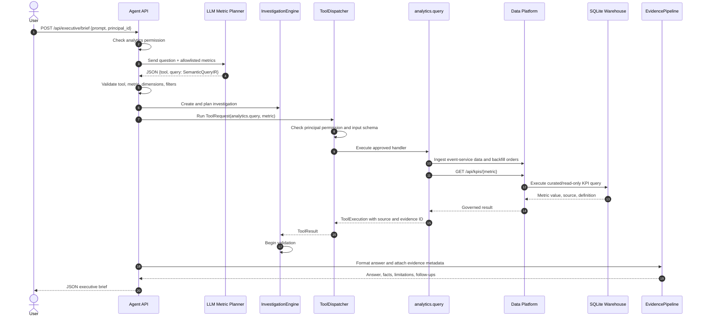

# Question-to-Answer Request Flow

This document describes how an executive question moves through Customer360 from the HTTP request to the final evidence-backed answer.

The production path uses the configured LLM to select an allowlisted analytics tool and metric. The model does not execute SQL or access operational databases directly. The existing keyword resolver is retained only for local no-LLM test mode.

## End-to-end flow



## Detailed steps

### 1. Receive the question

The client sends a question to the executive brief endpoint:

```http
POST /api/executive/brief
Content-Type: application/json

{
  "prompt": "How many times payment failed?",
  "principal_id": "cfo-1",
  "executive_role": "CFO"
}
```

Code:

- [Agent/app/main.py](../Agent/app/main.py): `executive_brief()` receives `ExecutiveBriefRequest`.
- [Agent/app/main.py](../Agent/app/main.py): `build_executive_brief()` owns the request workflow.

### 2. Check authorization before data access

The request is checked against the analytics permission map before a model or data tool is called. An unauthorized principal receives HTTP `403` and the workflow stops.

Code:

- [Agent/app/main.py](../Agent/app/main.py): `PERMISSIONS` and the authorization check at the start of `build_executive_brief()`.
- [Agent/DecisionOS/runtime/decision_os/tools.py](../Agent/DecisionOS/runtime/decision_os/tools.py): `PermissionMap` performs fail-closed resource checks.

### 3. Ask the LLM to classify the question and select a tool

`select_metric_with_model()` sends the question with the available governed metrics and the only permitted tool, `analytics.query`.

The expected model response is structured JSON:

```json
{
  "tool": "analytics.query",
  "query": {
    "metric": "average_cart_value",
    "dimensions": ["period"],
    "filters": {"payment_status": "succeeded"},
    "order": "desc",
    "limit": 25
  }
}
```

The application accepts the response only when:

- `tool` is exactly `analytics.query`.
- `query.metric` is in the application allowlist.
- `dimensions`, `filters`, `order`, and `limit` have the expected types and bounds.
- The response is valid JSON.

Code:

- [Agent/app/main.py](../Agent/app/main.py): `select_metric_with_model()` returns the validated metric and SemanticQueryIR fields.
- [Enterprise/DataPlatform/data_platform/semantic_query.py](../Enterprise/DataPlatform/data_platform/semantic_query.py): `SemanticQueryIR`, `QueryIRValidator`, and `SQLCompiler`.
- [Agent/DecisionOS/runtime/decision_os/model_provider.py](../Agent/DecisionOS/runtime/decision_os/model_provider.py): `ModelRequest`, `OpenAICompatibleModelProvider.complete()`, and `response_format` support.
- [run.sh](../run.sh): loads `.env` before starting services, including the LLM provider configuration.

If no real LLM is configured, local test mode uses `resolve_metric()`. If a configured LLM is unavailable or returns an invalid selection, the request fails closed to the governed default metric rather than allowing arbitrary tool execution.

### 4. Create and plan an investigation

After metric selection, the application creates an auditable investigation and prepares a plan before executing the tool.

Code:

- [Agent/DecisionOS/runtime/decision_os/engine.py](../Agent/DecisionOS/runtime/decision_os/engine.py): `InvestigationEngine.create()` and `InvestigationEngine.plan()`.
- [Agent/app/main.py](../Agent/app/main.py): investigation creation and planning inside `build_executive_brief()`.

### 5. Build the governed tool request

The selected metric and validated IR fields are placed into a `ToolRequest` for the cataloged analytics tool:

```python
ToolRequest(
    tool_name="analytics.query",
    principal_id=principal_id,
  input={
    "metric": "average_cart_value",
    "dimensions": ["period"],
    "filters": {"payment_status": "succeeded"},
    "order": "desc",
    "limit": 25,
  },
)
```

The model supplies intent selection only. The application constructs the actual request and does not trust model-generated executable code.

Code:

- [Agent/DecisionOS/runtime/decision_os/models.py](../Agent/DecisionOS/runtime/decision_os/models.py): `ToolRequest`.
- [Agent/DecisionOS/runtime/decision_os/catalog.py](../Agent/DecisionOS/runtime/decision_os/catalog.py): `TOOL_CATALOG` and the `analytics.query` contract.

### 6. Validate permissions and tool input

`ToolDispatcher.dispatch()` resolves the tool from the catalog, checks the principal's resource permission, validates required fields and types, and only then invokes the handler.

Code:

- [Agent/DecisionOS/runtime/decision_os/tools.py](../Agent/DecisionOS/runtime/decision_os/tools.py): `ToolDispatcher.dispatch()` and `_validate_input()`.
- [Agent/DecisionOS/runtime/decision_os/catalog.py](../Agent/DecisionOS/runtime/decision_os/catalog.py): `register_tool_catalog()`.

### 7. Execute the analytics query

The `analytics_metric_handler()` calls the Data Platform. It first refreshes event data, then uses `/api/semantic-query/execute` when dimensions or filters are present. The Data Platform validates the IR against the metric definition and compiles deterministic read-only SQL. Simple metric requests may use `/api/kpis/{metric}`. The returned result is wrapped in `ToolExecution` with source, query metadata, freshness, and an evidence reference.

Code:

- [Agent/app/main.py](../Agent/app/main.py): `analytics_metric_handler()`.
- [Enterprise/DataPlatform/data_platform/app.py](../Enterprise/DataPlatform/data_platform/app.py): `/api/ingest/event-service` and `/api/kpis/{metric}`.
- [Enterprise/DataPlatform/data_platform/warehouse.py](../Enterprise/DataPlatform/data_platform/warehouse.py): `EventWarehouse.kpi()`.

For the payment-failure question, `payment_failures` counts `PaymentFailed` events in `raw_events` and reports the source as `raw_events`.

### 8. Validate the investigation result

The investigation moves into validation after the tool result is returned. This keeps the result separate from the later answer wording.

Code:

- [Agent/DecisionOS/runtime/decision_os/engine.py](../Agent/DecisionOS/runtime/decision_os/engine.py): `InvestigationEngine.begin_validation()`.
- [Agent/app/main.py](../Agent/app/main.py): validation call in `build_executive_brief()`.

### 9. Format the answer from the returned value

`format_metric_answer()` converts the governed result into a human-readable answer, facts, and follow-up questions. It does not calculate the metric itself.

For example, a value of `3` produces an answer equivalent to:

> There have been 3 payment failures.

Code:

- [Agent/app/main.py](../Agent/app/main.py): `format_metric_answer()`.

If an LLM provider is configured, a second model call may polish the wording using only the returned facts. The deterministic answer remains available as the fallback.

### 10. Return the evidence-backed executive brief

The response includes the answer plus the investigation ID, facts, limitations, recommendations, follow-up questions, metrics, evidence, tool results, and trace steps.

Important evidence fields include:

- `evidence[].id`: analytics evidence reference.
- `evidence[].source`: Data Platform endpoint or fallback source.
- `evidence[].query`: selected tool, metric, and live/fallback state.
- `tool_results[].data`: returned metric value and source metadata.

Code:

- [Agent/app/main.py](../Agent/app/main.py): final response construction in `build_executive_brief()`.
- [Agent/DecisionOS/runtime/decision_os/evidence.py](../Agent/DecisionOS/runtime/decision_os/evidence.py): evidence validation and record construction for the investigation API.

## LLM request and response audit log

Every call made by `OpenAICompatibleModelProvider.complete()` writes JSON Lines records to `LLM_LOG_FILE`, which defaults to `logs/llm-api.jsonl`.

Each successful call produces:

1. A `request` record containing the endpoint, model, question, context, allowed tools, output limit, and response format.
2. A `response` record containing the provider response payload, including usage metadata when supplied by the endpoint.

Failed calls produce an `error` record with the endpoint, model, exception type, and error message before the exception is handled by the caller.

The authorization header and API key are never written to the log. Generated logs are ignored by Git through [.gitignore](../.gitignore).

Code:

- [Agent/DecisionOS/runtime/decision_os/model_provider.py](../Agent/DecisionOS/runtime/decision_os/model_provider.py): `OpenAICompatibleModelProvider._write_log()` and `complete()`.
- [.env.example](../.env.example): `LLM_LOG_FILE` configuration.

## Important boundary: `semantic_query.py`

[Enterprise/DataPlatform/data_platform/semantic_query.py](../Enterprise/DataPlatform/data_platform/semantic_query.py) still provides a governed semantic metadata and SQL-compilation API for direct Data Platform callers. Its `MetadataRetriever` uses keyword matching to find metric candidates.

That path is separate from the executive brief flow documented above:

- The executive brief calls the LLM planner in `Agent/app/main.py`.
- The selected metric is passed to `analytics.query`.
- The Data Platform executes the already-selected metric deterministically.
- The executive brief does not call `SemanticQueryPlanner.context()` or `MetadataRetriever.retrieve()`.

This separation keeps language understanding in the agent layer and keeps numerical computation, source lineage, and SQL execution in the Data Platform.

## Failure behavior

| Failure | Behavior |
| --- | --- |
| Principal lacks analytics permission | Return HTTP `403`; no model or analytics tool call |
| LLM is not configured | Use local deterministic resolver for development/test mode |
| LLM endpoint is unavailable | Use governed default metric; do not execute a model-selected unknown tool |
| LLM returns invalid JSON | Use governed default metric |
| LLM selects an unknown tool or metric | Reject selection and use governed default metric |
| Data Platform is unavailable | Return deterministic analytics fallback with a limitation |
| Analytics permission fails in the dispatcher | Return a denied `ToolResult` |