# Customer360 Solution Architecture

This diagram reflects the implemented runtime path and the governed boundaries between the agent, DecisionOS, enterprise services, and the analytical platform.

```mermaid
flowchart LR
    User[Executive UI\nquestion + brief]
    Agent[Agent API\nFastAPI :8009]
    DecisionOS[DecisionOS runtime<br/>plan, dispatch, validate]
    Tools[Governed tools<br/>analytics, semantic, graph, RAG<br/>permission, lineage, decisions]
    DataPlatform[Data Platform\nFastAPI :8010]
    Semantic[Semantic query planner\nallowlisted metrics + dimensions]
    TextSQL[Text-to-SQL service\ncontext + read-only SELECT validation]
    Warehouse[(SQLite warehouse\nraw_events + curated models)]

    Services[Operational services<br/>CRM :8001, Product :8002<br/>Shopping :8003, Site :8004<br/>Feedback :8005, Marketing :8006<br/>Orchestration :8008]
    Events[Event service :8007\nimmutable event envelopes]
    Simulator[Simulator :8080\nsynthetic data + scenarios]
    Evidence[Evidence + persistence<br/>working memory, audit<br/>decisions, provenance]
    LLM[Optional LLM provider\nintent selection / wording only]

    User -->|HTTP executive question| Agent
    Agent -->|create + plan investigation| DecisionOS
    Agent -.->|optional bounded model calls| LLM
    DecisionOS -->|permission-first dispatch| Tools
    Tools -->|analytics / semantic / SQL| DataPlatform
    Tools -.->|replaceable adapters| Services
    DecisionOS -->|evidence package + audit| Evidence
    Evidence -.->|validated brief| Agent

    DataPlatform --> Semantic
    DataPlatform --> TextSQL
    Semantic -->|parameterized read-only SQL| Warehouse
    TextSQL -->|single SELECT / WITH| Warehouse

    Services -->|domain APIs + events| Events
    Events -->|ingest + backfill| DataPlatform
    DataPlatform -->|raw + curated models| Warehouse
    Simulator -->|seed / scenario events| Services
    Simulator -->|event generation| Events

    classDef client fill:#e8f0ff,stroke:#3973c6,color:#16345f
    classDef governance fill:#e5f5ed,stroke:#2d8a62,color:#164a35
    classDef data fill:#fff3d6,stroke:#bd8422,color:#5c4213
    classDef service fill:#f0edf8,stroke:#7664a8,color:#352d55
    classDef storage fill:#edf1f4,stroke:#6f7c87,color:#303940
    classDef optional fill:#f7f7f7,stroke:#9aa0a6,color:#444

    class User,Agent client
    class DecisionOS,Tools,Evidence governance
    class DataPlatform,Semantic,TextSQL data
    class Services,Events,Simulator service
    class Warehouse storage
    class LLM optional
```

## Request and evidence path

1. The Executive UI posts a question and principal to the Agent API.
2. The Agent API creates an investigation and asks DecisionOS to plan it.
3. DecisionOS checks authorization, validates tool input, and dispatches only governed capabilities.
4. The Data Platform performs semantic-query execution or validated read-only Text-to-SQL over curated models.
5. Operational services remain owners of their private databases; cross-service joins happen in the Data Platform.
6. Evidence, freshness, lineage, limitations, and audit metadata are attached before the executive brief is returned.

## Key boundaries

- The LLM selects intent or helps phrase an answer; it does not execute SQL or act as the system of record.
- Event envelopes are immutable and feed the analytical warehouse through ingestion and backfill.
- DecisionOS agents access enterprise data through governed tools and adapters, never direct operational database access.
- Graph, RAG, durable persistence, and production storage remain replaceable runtime ports where implemented.
