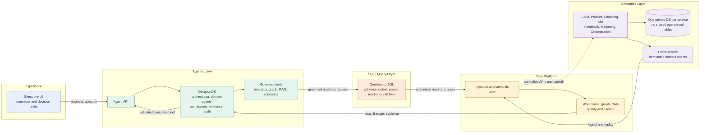

# Customer360 One-Page System Architecture

Compact view for a single PPT slide or architecture image.

## Core architecture rules

- **Enterprise:** Each microservice owns its API, domain logic, schema, and private database.
- **Events:** Services publish immutable domain events; the Data Platform ingests and replays them.
- **Data Platform:** Owns cross-service joins, curated models, metrics, semantic definitions, lineage, graph, RAG, and quality checks.
- **SQL boundary:** Questions become authorized schema context and validated read-only SQL. The parser cannot write to operational stores.
- **Agentic layer:** DecisionOS plans investigations and calls governed tools. Agents never access service databases directly.
- **Evidence:** Answers return facts with source, freshness, definitions, limitations, and audit references.

## Slide takeaway

`Private service databases -> domain events and APIs -> Data Platform -> governed SQL and tools -> DecisionOS -> evidence-backed executive brief`
