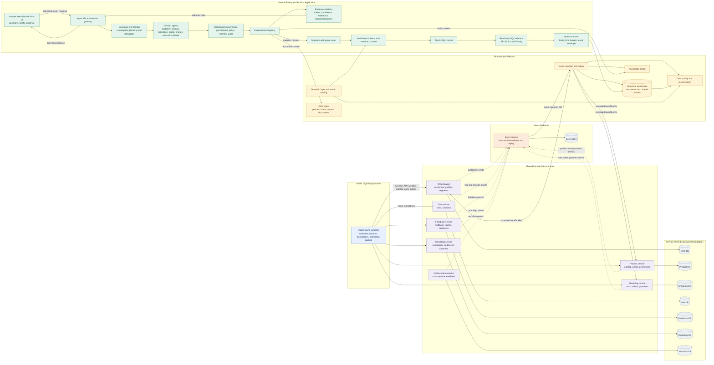

# Customer360 System Architecture

This view separates public business applications from the internal enterprise decision application. Public applications perform customer transactions through domain microservice APIs and generate operational events. The internal application uses governed agents and analytics over shared data-platform capabilities; it does not route public transactions through the agent system or access operational databases directly. Domain microservices may serve multiple applications, while each service owns its private database.

Public applications call the domain service APIs directly for customer-facing operations. These services may be reused by multiple applications, but each service owns its own database. The internal executive application follows a separate request path through the agent, governance, and query layers into the shared data platform. Operational events connect the service side to that platform; there is no public-website-to-Agent-API path.

## Architecture in Text

### Experience Layer

- **Public-facing websites**
    - **Purpose:** Deliver public customer journeys, perform business transactions, and capture visitor interactions.
    - **Connectors:** Call relevant domain microservice APIs, including CRM, Product, Shopping, Site, Feedback, and Marketing. They do not call the Agent API.
- **Internal executive decision UI**
    - **Purpose:** Let enterprise users submit questions and decision requests, and review validated briefs and evidence.
    - **Connectors:** Sends requests to the Agent API and session gateway; receives the resulting executive brief through that gateway.

### Agentic Intelligence Layer

- **Agent API and session gateway**
    - **Purpose:** Accept executive requests and return validated executive briefs.
    - **Connectors:** Receives requests from the internal executive UI, forwards them to the Executive orchestrator, and returns results from the Evidence validator.
- **Executive orchestrator**
    - **Purpose:** Plan investigations and delegate work to the appropriate domain agents.
    - **Connectors:** Receives requests from the gateway and dispatches work to domain agents.
- **Domain agents**
    - **Purpose:** Investigate bounded customer, product, promotion, digital, finance, and voice-of-customer questions.
    - **Connectors:** Work through DecisionOS governance and its governed tool registry; they do not access operational databases directly.
- **DecisionOS governance**
    - **Purpose:** Apply permissions, policy, memory boundaries, and audit controls to agent work.
    - **Connectors:** Governs domain-agent access to the governed tool registry.
- **Governed tool registry**
    - **Purpose:** Expose approved analytics, semantic, graph, document retrieval, lineage, and scenario capabilities to agents.
    - **Connectors:** Routes analytics and governed SQL requests to the query router, entity lookups to the knowledge graph, document lookups to the RAG index, and findings to the Evidence validator.
- **Evidence validator**
    - **Purpose:** Validate claims, confidence, limitations, and recommendations before they are presented as an executive brief.
    - **Connectors:** Receives findings from governed tools and returns the validated brief to the gateway.

### SQL and Query Interpretation Layer

- **Question and query router**
    - **Purpose:** Direct governed analytics requests into the SQL interpretation flow.
    - **Connectors:** Receives analytics and SQL requests from the governed tool registry and passes them to the Schema context service.
- **Schema context service**
    - **Purpose:** Supply the parser with authorized tables, columns, and joins, informed by approved semantic definitions.
    - **Connectors:** Receives requests from the query router and metric context from the Semantic layer; passes schema context to the Text-to-SQL parser.
- **Text-to-SQL parser**
    - **Purpose:** Translate natural-language analytical intent into a SQL query using the supplied schema context.
    - **Connectors:** Receives question and schema context from the Schema context service; sends generated SQL to the SQL validator and policy guard.
- **SQL validator and policy guard**
    - **Purpose:** Enforce read-only query policy, allowing only validated `SELECT` or `WITH` queries.
    - **Connectors:** Receives generated SQL from the parser and sends approved queries to the Query executor.
- **Query executor**
    - **Purpose:** Execute approved queries with limits and a time budget, returning a bounded result envelope.
    - **Connectors:** Receives approved SQL from the guard and queries the Analytical warehouse.

### Data Platform Layer

- **Event ingestion and replay**
    - **Purpose:** Ingest immutable, idempotent event envelopes and make them available to analytical and graph projections, quality checks, and controlled backfills.
    - **Connectors:** Receives events from the Event service; writes to the Analytical warehouse and Knowledge graph; supplies data to Data quality and reconciliation; invokes controlled backfill APIs on CRM, Product, and Shopping services.
- **Semantic layer and metric catalog**
    - **Purpose:** Define business metrics, dimensions, and lineage for consistent analytical interpretation.
    - **Connectors:** Supplies metric and schema context to the Schema context service and definitions to Data quality and reconciliation.
- **Analytical warehouse**
    - **Purpose:** Store raw event data and curated cross-service analytical models.
    - **Connectors:** Receives data from event ingestion, serves queries from the Query executor, and supplies data to Data quality and reconciliation.
- **Knowledge graph**
    - **Purpose:** Represent enterprise entities and their relationships for governed entity investigation.
    - **Connectors:** Receives event-derived projections from event ingestion and entity-context requests from the governed tool registry.
- **RAG index**
    - **Purpose:** Make policies, briefs, reports, and other documents available for governed retrieval.
    - **Connectors:** Receives document-context requests from the governed tool registry.
- **Data quality and reconciliation**
    - **Purpose:** Check freshness, completeness, and contradictions across ingested data and semantic definitions.
    - **Connectors:** Receives inputs from event ingestion, the Analytical warehouse, and the Semantic layer.

### Enterprise Operational Layer

- **CRM service**
    - **Purpose:** Own customer profiles and segments.
    - **Connectors:** Owns the CRM database, publishes customer events to the Event service, and exposes a controlled backfill API to event ingestion.
- **Product service**
    - **Purpose:** Own products, categories, prices, and promotions.
    - **Connectors:** Owns the Product database, publishes product and promotion events to the Event service, and exposes a controlled backfill API to event ingestion.
- **Shopping service**
    - **Purpose:** Own carts, orders, and payments.
    - **Connectors:** Owns the Shopping database, publishes cart, order, and payment events to the Event service, and exposes a controlled backfill API to event ingestion.
- **Site service**
    - **Purpose:** Own site-related data such as visits and sessions.
    - **Connectors:** Receives visitor-interaction and session data from public-facing websites, owns the Site database, and publishes visit and session events to the Event service.
- **Feedback service**
    - **Purpose:** Own customer feedback, ratings, and sentiment data.
    - **Connectors:** Owns the Feedback database and publishes feedback events to the Event service.
- **Marketing service**
    - **Purpose:** Own campaigns, audiences, and channels.
    - **Connectors:** Owns the Marketing database and publishes campaign events to the Event service.
- **Event service**
    - **Purpose:** Persist immutable domain-event envelopes and support replay.
    - **Connectors:** Receives domain events from operational services, stores them in the Event store, and sends them to event ingestion through its ingestion API.
- **Orchestration service**
    - **Purpose:** Own cross-service operational workflows.
    - **Connectors:** Owns the Workflow database and publishes workflow events to the Event service.

### Private Operational Data Stores

- **CRM, Product, Shopping, Site, Feedback, and Marketing databases**
    - **Purpose:** Persist the operational records owned by their corresponding services.
    - **Connectors:** Each database is accessed by its owning service; cross-service consumers use service APIs or domain events, not shared tables.
- **Event store**
    - **Purpose:** Persist immutable event envelopes for replay and downstream ingestion.
    - **Connectors:** Accessed by the Event service, which exposes events to event ingestion through its API.
- **Workflow database**
    - **Purpose:** Persist workflow state owned by the Orchestration service.
    - **Connectors:** Accessed by the Orchestration service; workflow changes are shared downstream as events.

## Architectural rules

- Every Enterprise service owns its database, schema, API, and domain invariants.
- Operational services communicate through APIs and domain events; they do not share tables.
- The Event service stores immutable envelopes for replay and analytical ingestion.
- The Data Platform owns cross-service joins, curated analytical models, semantic definitions, lineage, quality checks, graph projections, and document retrieval indexes.
- The SQL layer is a controlled boundary: it selects authorized schema context, parses questions, validates SQL, enforces read-only execution, and returns provenance-rich results.
- The Agentic layer never accesses operational databases directly. Agents use governed tools with permission checks, bounded inputs, evidence references, and audit records.
- The LLM is an investigator and query-intent interpreter, not the system of record and not an unrestricted SQL executor.
- Executive answers must separate facts, interpretations, hypotheses, recommendations, confidence, freshness, and limitations.

## Primary paths

- **Public transaction path:** `Public website -> domain microservice API -> service-owned database`
- **Internal decision path:** `Intranet executive UI -> Agent API -> DecisionOS -> governed tool -> SQL/query layer -> Data Platform -> curated warehouse -> evidence validator -> executive brief`
- **Event and analytics path:** `Domain microservice -> Event service -> Data Platform ingestion -> warehouse, semantic layer, graph, and quality controls`

